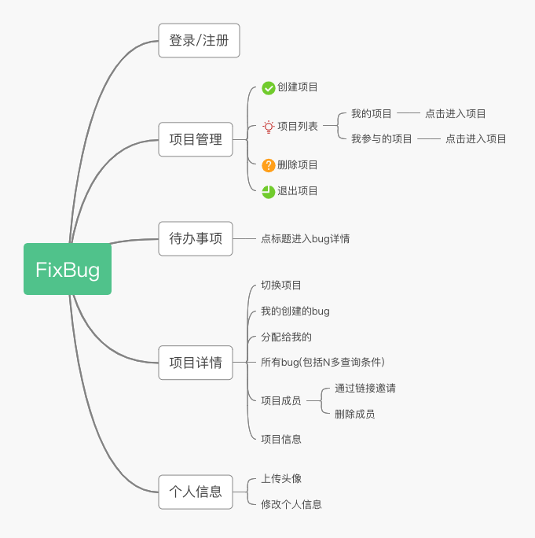
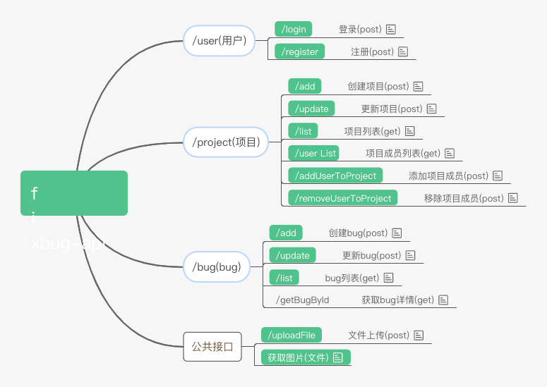
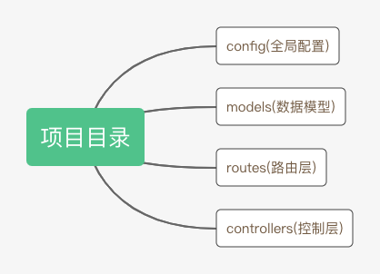

## 基于koa2的bug管理系统后台API

### 功能导图
 

### API导图
 
[API文档](https://www.processon.com/view/link/5cbfeb08e4b085d01083220e)文档地址

### 项目主要目录
 

需要安装[mongodb](https://www.mongodb.com/)

### 安装依赖
yarn or yarn install

### 运行开发环境
yarn dev

### 发布环境运行
yarn prd (基于pm2)

